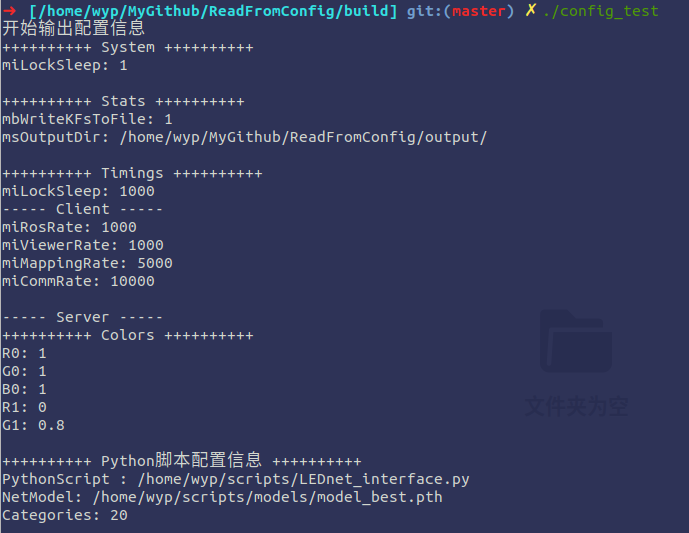

[TOC]

# 版本说明

2020-06-13

* master：仅仅只是一个配置文件读取的操作


# 1 功能说明


- [ ] 从配置文件 `./config/config.yawl` 中读取配置配置信息（只使用到OpenCV）
- [ ] 


# 2 使用方法


在文件 `./include/config/config.h`里面修改配置文件访问路径，访问根路径在CMakeList.txt里面配置，使用方法参考`./test/config_test.cpp`

```shell
mkdir build
cd build
cmake ..
make -j8
```


